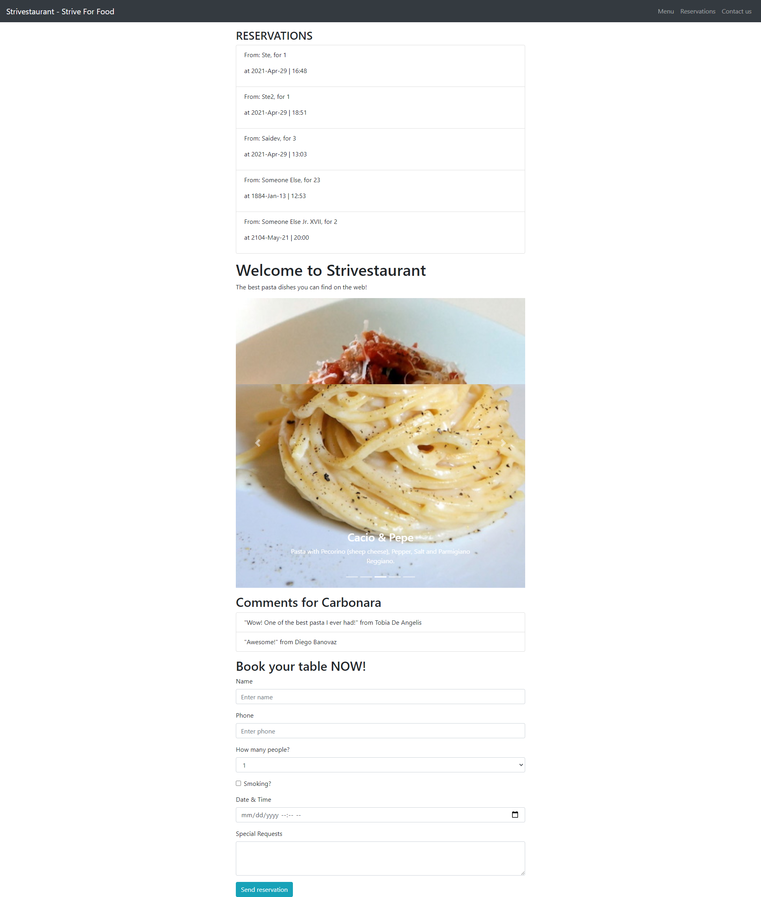

## Module 4 Day 7 - Homework Brief

#### Conditional Rendering

###### In these exercises you'll apply your skills creating new rendering conditions for the Strivestaurant project.</em>

> _Clone the repo to get started ---> [Strivesaurant](https://github.com/irvelervel/mar21-strivestaurant-pt3)_

**To Do:**

- [ ] **1.** Transform DishComments functional component into a class based one.
       

- [ ] **2.** In the ReservationForm component make the Form actually visible just after clicking on the h2 above it (use the component state!).
       

- [ ] **3.** Change MyNavBar component in a class-based one; create a constructor and log a message in the console as the component initializes.
       

- [ ] **4.** In the DishComments component use the ternary operator to show a piece of text instead of the ListGroup if the dish prop is a falsy value.
       

- [ ] **5.** In the Home component, hide the DishComments component with a short-circuit operator if the selected dish name is "Amatriciana".
       

- [ ] **6.** In the Home component, show an Alert component instead of the ReservationForm if even a single a comment of the selected dish has a rating below 5.
       

- [ ] **7.** In the Home component, show an Alert component instead of the
      ReservationForm if even a single a comment of the selected dish has a
      rating below 5.
       

- [ ] **8.** In Home.jsx give a "header" prop to the Reservations component. If
      present, this component should display it instead of the generic
      'RESERVATIONS' in its h3.
       

- [ ] **9.** In the Home component use a ternary operator to replace the text inside
      the h1 and the p tags above the carousel with the values of the props
      "newTitle" and "newPayoff" respectively, if present.
       

- [ ] **10.** Change the "Strive for food" text in the MyNavBar component to "The
    perfect place for pasta lovers" if the prop title has a value of
    "Strivestaurant".
     

Initial HW ScreenShot

Finished HW ScreenShot

